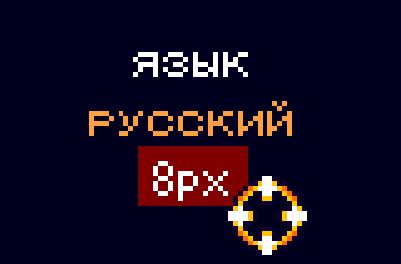
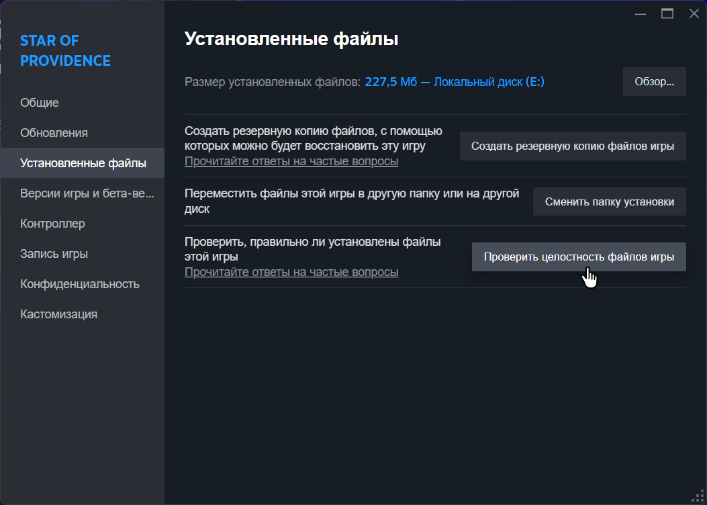

# Star of Providence - русская локализация

> Это AI-перевод с помощью модели Sonnet 4.6 (Anthropic) + ручная вычитка и адаптация игровых терминов.

Неофициальный русский перевод для [Star of Providence](https://store.steampowered.com/app/603960/Star_of_Providence/) · переведено 100%.

---

## Установка

1. Скачай [последний релиз](../../releases/latest) и распакуй
2. Запусти `install_patch.bat` (подтверди путь к игре или укажи вручную)
3. **Обязательно** в игре: **Опции → Язык → «русский»**, затем в том же меню **«8px»** (не 16px)



**Требование:** режим **8px** обязателен при русском языке. Без него возможны обрезка текста, пропадание цен в магазине и другие сбои отображения.

---

## Восстановление оригинала

В Steam:

1. ПКМ по игре → **Свойства**
2. **Установленные файлы** → **Проверить целостность файлов игры**



Steam вернёт оригинальные `localization/` и шрифт.

---

<div align="center">

### Поддержать автора

Если перевод пригодился - можно закинуть на кофе :3

[](https://www.donationalerts.com/r/sergaris)

<sub>Кнопка не работает? → [прямая ссылка](https://www.donationalerts.com/c/sergaris)</sub>

</div>

---

## Об ошибках в переводе

Если что-то переведено неточно или звучит странно - открой [Issue](../../issues) и опиши:
- где в игре встретилась строка
- что не так
- свой вариант (если есть)

Перед правками: **[docs/LOCALIZATION.md](docs/LOCALIZATION.md)**.

---

<details>
<summary>Для продвинутых пользователей</summary>

### Ручная установка

1. Скопируй `localization/` в папку игры с заменой
2. `fonts/NotoSans-ExtraBold.ttf` → `fonts/Chusung-220206.ttf`
3. **Обязательно:** язык **«русский»** + **8px** (не 16px)

### Утилита patch.py

```bash
python scripts/patch.py init --game-path "E:\SteamLibrary\steamapps\common\Star of Providence"
python scripts/patch.py validate
python scripts/patch.py check-release
```

`check-release` сравнивает локальную версию (файл `VERSION`) с последним релизом на GitHub.

### При обновлении игры

1. `patch.py init --force`
2. Переведи новые строки
3. `install_patch.bat`

</details>
